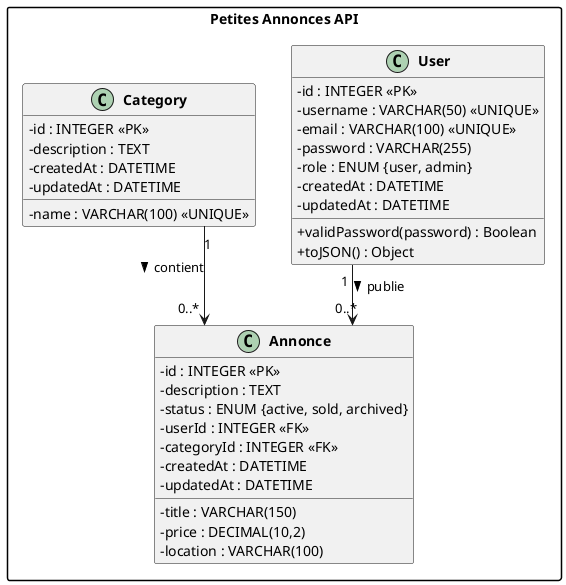
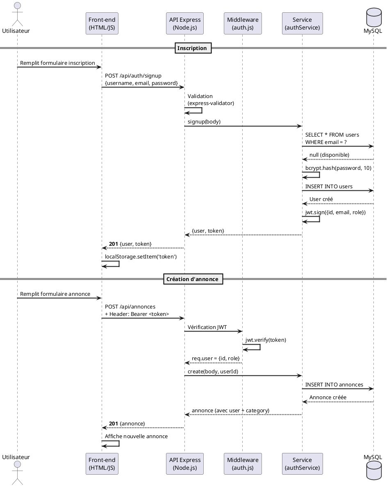

<div align="center">

# 🏪 Petites Annonces

**API REST complète pour une plateforme de petites annonces**

Développée avec Node.js, Express, Sequelize & MySQL

[](https://nodejs.org/)
[](https://expressjs.com/)
[](https://www.mysql.com/)
[](https://sequelize.org/)
[](https://swagger.io/)
[](https://jwt.io/)

---

*Projet réalisé dans le cadre du TP Développement API Express*

</div>

---

## 📋 Présentation

Cette application est une **plateforme de petites annonces** permettant aux utilisateurs de publier, consulter, modifier et supprimer des annonces classées par catégories.

L'API respecte les principes **REST**, est sécurisée par **JWT** et entièrement documentée via **Swagger**. Un **front-end** est inclus pour interagir avec l'API directement depuis le navigateur.

---

## 👤 Auteur

| Nom | GitHub |
|-----|--------|
| **Yannis LEVY** | [@Lazimov](https://github.com/Lazimov) |

---

## ⚙️ Stack technique

| Technologie | Rôle |
|:-----------:|------|
| **Node.js** + **Express** | Serveur HTTP et routing |
| **Sequelize** | ORM pour MySQL |
| **MySQL** | Base de données relationnelle |
| **JWT** | Authentification par token |
| **bcrypt** | Hashage des mots de passe |
| **express-validator** | Validation des données entrantes |
| **CORS** | Gestion des requêtes cross-origin |
| **Swagger** | Documentation interactive de l'API |

---

## 🗃️ Modèle de données

### Diagramme de classes UML


<details>
<summary>📝 Code source PlantUML</summary>



</details>

### Diagramme de séquence — Inscription & Création d'annonce


<details>
<summary>📝 Code source PlantUML</summary>



</details>

---

## 🚀 Installation

### Prérequis

- **Node.js** v18+
- **MySQL** (via XAMPP ou autre)

### Mise en route

```bash
# Cloner le projet
git clone https://github.com/Lazimov/petites-annonces.git
cd petites-annonces

# Installer les dépendances
npm install

# Créer la base de données (phpMyAdmin ou CLI)
# CREATE DATABASE petites_annonces;

# Lancer les migrations
npx sequelize-cli db:migrate

# Insérer les données de démo
npx sequelize-cli db:seed:all

# Démarrer le serveur
npm start
```

> 💡 Modifier le fichier `.env` si besoin (mot de passe MySQL, port, etc.)

---

## 🔗 Accès

| Service | URL |
|---------|-----|
| 🌐 Front-end | [http://localhost:3000](http://localhost:3000) |
| 📚 Swagger | [http://localhost:3000/api-docs](http://localhost:3000/api-docs) |

---

## 📡 Routes API

### 🔐 Authentification

| Méthode | Route | Description | Auth |
|:-------:|-------|-------------|:----:|
| `POST` | `/api/auth/signup` | Inscription | ❌ |
| `POST` | `/api/auth/login` | Connexion | ❌ |
| `GET` | `/api/auth/profile` | Profil utilisateur | 🔒 |

### 📦 Annonces

| Méthode | Route | Description | Auth |
|:-------:|-------|-------------|:----:|
| `GET` | `/api/annonces` | Lister les annonces | ❌ |
| `GET` | `/api/annonces/:id` | Détail d'une annonce | ❌ |
| `POST` | `/api/annonces` | Créer une annonce | 🔒 |
| `PUT` | `/api/annonces/:id` | Modifier une annonce | 🔒 Propriétaire |
| `DELETE` | `/api/annonces/:id` | Supprimer une annonce | 🔒 Propriétaire / Admin |

### 🏷️ Catégories

| Méthode | Route | Description | Auth |
|:-------:|-------|-------------|:----:|
| `GET` | `/api/categories` | Lister les catégories | ❌ |
| `GET` | `/api/categories/:id` | Détail + annonces | ❌ |
| `POST` | `/api/categories` | Créer une catégorie | 🔒 Admin |
| `PUT` | `/api/categories/:id` | Modifier une catégorie | 🔒 Admin |
| `DELETE` | `/api/categories/:id` | Supprimer une catégorie | 🔒 Admin |

> 🔒 = Token JWT requis dans le header `Authorization: Bearer <token>`

---

## 🧪 Comptes de démo

| Rôle | Email | Mot de passe |
|:----:|-------|:------------:|
| 👑 Admin | `admin@petitesannonces.fr` | `admin123` |
| 👤 User | `jean@example.com` | `password123` |
| 👤 User | `marie@example.com` | `password123` |

---

## 📁 Structure du projet

```
petites-annonces/
│
├── 📄 app.js                    # Point d'entrée
├── 📄 .env                      # Variables d'environnement
├── 📄 .sequelizerc              # Config CLI Sequelize
│
├── 📂 config/
│   ├── config.js                # Config Sequelize (dev/test/prod)
│   ├── database.js              # Connexion BDD
│   └── swagger.js               # Config Swagger
│
├── 📂 models/
│   ├── index.js                 # Associations
│   ├── User.js                  # Modèle utilisateur
│   ├── Annonce.js               # Modèle annonce
│   └── Category.js              # Modèle catégorie
│
├── 📂 migrations/               # Création des tables
├── 📂 seeders/                  # Données de démonstration
│
├── 📂 routes/                   # Définition des routes + Swagger
├── 📂 controllers/              # Logique HTTP (req/res)
├── 📂 services/                 # Logique métier
├── 📂 middlewares/               # Auth JWT + rôles
├── 📂 validators/               # Validation express-validator
│
└── 📂 public/
    └── index.html               # Front-end (bonus)
```

---

## 🔒 Sécurité

- **bcrypt** — Hashage des mots de passe (salt rounds: 10)
- **JWT** — Authentification stateless avec expiration 24h
- **CORS** — Configuration des origines autorisées
- **express-validator** — Validation et sanitization des entrées
- **Contrôle d'accès** — Routes protégées par rôle (user / admin)

---

<div align="center">

*Projet réalisé dans le cadre du TP Développement API Express*

**Formateur** : Bastien Flanquart

</div>
